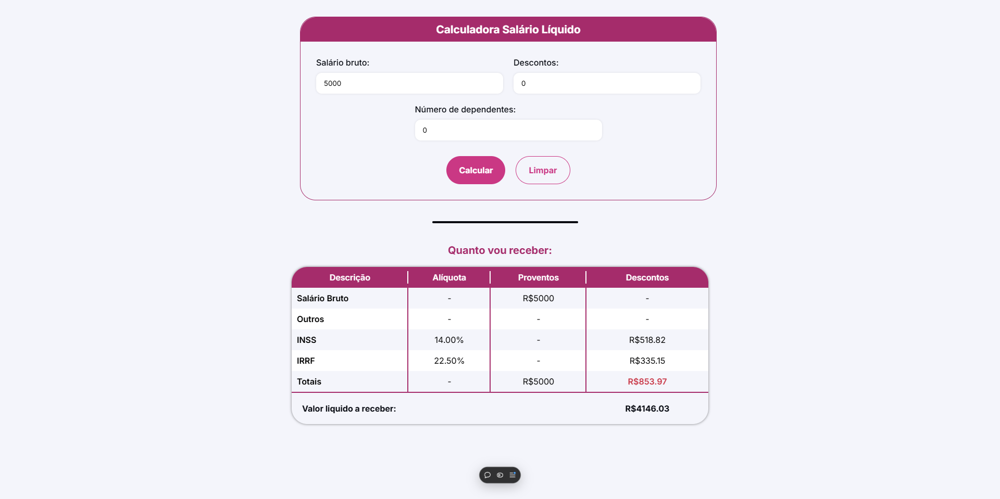

 ## 💻  Calculadora de Salário Líquido

### 🔥 Introdução

Este projeto é uma calculadora de salário desenvolvida por mim, inspirado pela minha experiência na área de Departamento Pessoal. Sempre tive a vontade de criar uma ferramenta que pudesse ajudar as pessoas a verificarem se o valor que elas recebem está de acordo com a lei. Com um entendimento sólido sobre como realizar esses cálculos, desenvolvi este projeto que pode beneficiar muitas pessoas .





 ## :rocket: Tecnologias

Esse projeto foi desenvolvido com as seguintes tecnologias:

✔️TypeScript

✔️React-vite

✔️Styled-components


## ⚙ Configuração

```
- $ git clone https://github.com/diegofchagas/salary-calc.git

- Para instalar as dependências:
> npm i

- Vá para a pasta do projeto

- Para iniciar a aplicação:
> npm run dev
```

### 🆙 Atualizações futuras

- Adicionar uma calculora de cálculo de férias.

## Desenvolvedor 
<span style="font-size: larger;">**Diego Chagas**</span>